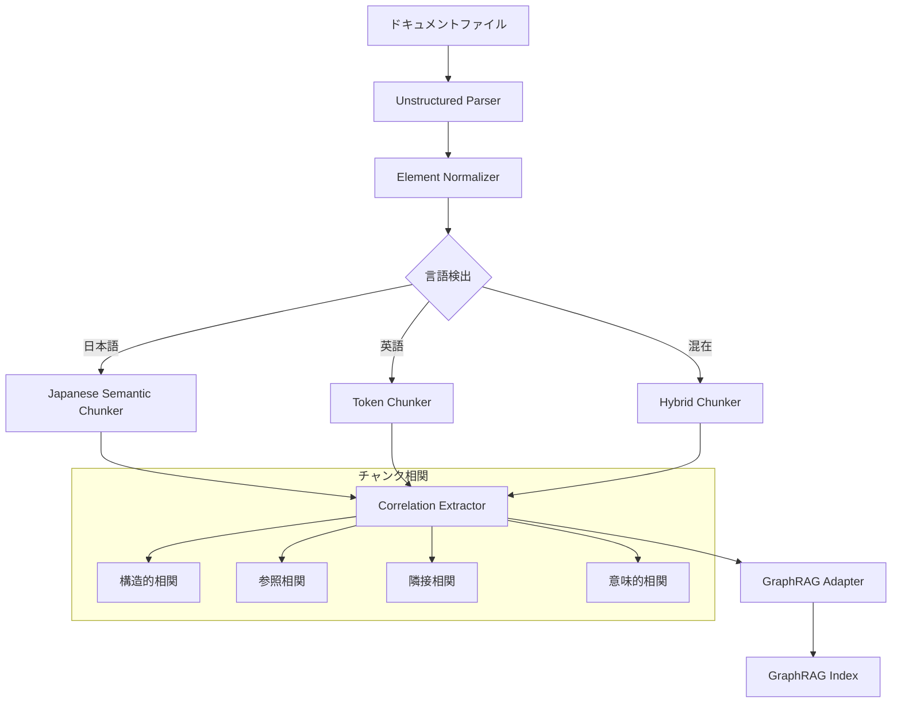

# Feature: Document Import for GraphRAG

**Feature ID**: FEAT-002
**Feature Name**: Document Import for GraphRAG (Unstructured + 日本語対応チャンク化)
**Status**: Requirements Definition
**Created**: 2025-12-05
**Author**: @orchestrator
**Parent Feature**: FEAT-001 (GraphRAG MCP Server)
**Constitutional Compliance**: Pending Validation

---

## 1. Executive Summary

### 1.1 概要

GraphRAG へのドキュメントインポート機能を開発する。Unstructured ライブラリを使用して多様なドキュメント形式（PDF、DOCX、PPTX、HTML等）を定型化し、日本語に最適化されたチャンク分割を行い、チャンク間の相関関係を可視化できる形で GraphRAG にインポートする。

### 1.2 ビジネス価値

- **多様なドキュメント対応**: PDF、Word、PowerPoint、HTML など様々な形式のドキュメントを GraphRAG で検索可能に
- **日本語最適化**: 文脈を考慮した日本語チャンク分割により、検索精度を向上
- **相関可視化**: チャンク間の関係性を把握し、ドキュメント構造の理解を支援
- **パイプライン自動化**: MCP ツールによるドキュメント取り込みの自動化

### 1.3 技術スタック

| コンポーネント | 技術選定 | 理由 |
|--------------|---------|------|
| ドキュメント解析 | Unstructured | 多形式対応、構造抽出が優秀 |
| 日本語トークナイザ | fugashi + ipadic/unidic | 形態素解析による高精度分割 |
| チャンク分割 | カスタム Semantic Chunker | 日本語文脈考慮 |
| 相関グラフ | NetworkX + GraphRAG | チャンク間の関係性表現 |
| インポートAPI | FEAT-001 MCP Server 拡張 | 既存基盤活用 |

### 1.4 参照資料

- `References/graphrag/graphrag/index/input/` - GraphRAG 入力ローダー
- `References/graphrag/graphrag/index/text_splitting/` - テキスト分割実装
- Unstructured Documentation: https://unstructured-io.github.io/unstructured/
- GraphRAG Indexing Dataflow: `References/graphrag/docs/index/default_dataflow.md`

---

## 2. EARS Requirements

### 2.1 Ubiquitous Requirements (ユビキタス要件)

#### REQ-DIM-001: Library-First Architecture
**The** Document Import module **SHALL** be implemented as an independent library within the GraphRAG MCP Server package.

**Acceptance Criteria**:
- [ ] 独立したモジュールディレクトリ (`lib/graphrag-mcp-server/src/graphrag_mcp_server/import/`)
- [ ] 明確なパブリック API (`DocumentImporter`, `ChunkProcessor`, `CorrelationBuilder`)
- [ ] 単独でのユニットテスト実行可能

**Constitutional Reference**: Article I (Library-First Principle)

---

#### REQ-DIM-002: CLI Interface
**The** Document Import module **SHALL** expose functionality through CLI commands.

**Acceptance Criteria**:
- [ ] `graphrag-mcp import <path>` コマンドの実装
- [ ] `graphrag-mcp import --format pdf,docx,html` フォーマット指定
- [ ] `graphrag-mcp import --language ja` 言語指定
- [ ] `graphrag-mcp import --chunk-strategy semantic` チャンク戦略指定
- [ ] `--help` による使用方法表示
- [ ] 進捗表示（プログレスバー）

**Constitutional Reference**: Article II (CLI Interface Mandate)

---

#### REQ-DIM-003: Test Coverage
**The** Document Import module **SHALL** maintain test coverage of at least 80%.

**Acceptance Criteria**:
- [ ] 全 EARS 要件に対応するテスト
- [ ] 日本語ドキュメントのテストケース
- [ ] 多形式ドキュメント (PDF, DOCX, HTML) のテストケース
- [ ] チャンク相関のテストケース

**Constitutional Reference**: Article III (Test-First Imperative)

---

#### REQ-DIM-004: Security - No Credential Storage
**The** Document Import module **SHALL NOT** store any credentials in code or configuration files.

**Acceptance Criteria**:
- [ ] Unstructured API キー (使用する場合) は環境変数から取得
- [ ] ドキュメントパスのバリデーション（パストラバーサル防止）
- [ ] 一時ファイルの安全な削除

**Constitutional Reference**: Article III (Security Requirements)

---

### 2.2 Event-Driven Requirements (イベント駆動要件)

#### REQ-DIM-010: Document Parsing Request
**WHEN** a client requests document import with a file path, **the** Document Import module **SHALL** parse the document using Unstructured and extract structured elements.

**Acceptance Criteria**:
- [ ] PDF ファイルの解析（テキスト、テーブル、画像キャプション）
- [ ] DOCX ファイルの解析（段落、見出し、リスト、テーブル）
- [ ] PPTX ファイルの解析（スライドテキスト、ノート）
- [ ] HTML ファイルの解析（構造化テキスト抽出）
- [ ] Markdown ファイルの解析（見出し、段落、コードブロック）
- [ ] 解析エラー時の適切なエラーレスポンス

**Implementation**:
```python
from unstructured.partition.auto import partition

async def parse_document(file_path: Path) -> list[Element]:
    elements = partition(filename=str(file_path))
    return elements
```

---

#### REQ-DIM-011: Element Normalization
**WHEN** document elements are extracted, **the** Document Import module **SHALL** normalize them into a unified format for GraphRAG ingestion.

**Acceptance Criteria**:
- [ ] Unstructured Element → GraphRAG Document 変換
- [ ] メタデータ保持（ページ番号、セクション、ソースファイル）
- [ ] 要素タイプのタグ付け（Title, NarrativeText, Table, ListItem 等）
- [ ] 親子関係の構造保持

**Output Format**:
```python
@dataclass
class NormalizedElement:
    id: str
    text: str
    element_type: str  # Title, NarrativeText, Table, etc.
    metadata: dict     # page_number, section, source_file, etc.
    parent_id: str | None
    children_ids: list[str]
```

---

#### REQ-DIM-012: Japanese Semantic Chunking
**WHEN** processing Japanese text, **the** Document Import module **SHALL** split text into semantically coherent chunks that preserve context.

**Acceptance Criteria**:
- [ ] 形態素解析による文境界検出 (fugashi/MeCab)
- [ ] 段落・セクション境界の尊重
- [ ] 最大トークン数制限（デフォルト: 300トークン）
- [ ] オーバーラップ設定（デフォルト: 50トークン）
- [ ] 文の途中で切らない分割
- [ ] 箇条書き・表は可能な限り保持

**Implementation Strategy**:
```python
class JapaneseSemanticChunker:
    def __init__(
        self,
        max_tokens: int = 300,
        overlap_tokens: int = 50,
        respect_sentences: bool = True,
    ):
        self.tokenizer = Tokenizer()  # fugashi-based
        
    def chunk(self, text: str) -> list[TextChunk]:
        # 1. 文分割（句点・疑問符・感嘆符で分割）
        # 2. セマンティックユニットの構築
        # 3. トークン数に基づくチャンク統合
        # 4. オーバーラップ付きチャンク生成
        pass
```

---

#### REQ-DIM-013: Multi-language Chunk Strategy
**WHEN** processing mixed-language documents, **the** Document Import module **SHALL** detect language and apply appropriate chunking strategies.

**Acceptance Criteria**:
- [ ] 言語自動検出 (langdetect または lingua)
- [ ] 日本語: セマンティックチャンキング
- [ ] 英語: TokenTextSplitter (GraphRAG標準)
- [ ] 混在テキスト: 優勢言語の戦略適用
- [ ] 言語ごとの統計情報出力

---

#### REQ-DIM-014: Chunk Correlation Extraction
**WHEN** chunks are generated, **the** Document Import module **SHALL** extract and store correlation relationships between chunks.

**Acceptance Criteria**:
- [ ] 構造的相関: 同一セクション、同一ドキュメント
- [ ] 参照相関: 相互参照、引用、リンク
- [ ] 意味的相関: 類似トピック（オプション、埋め込みベース）
- [ ] 隣接相関: 前後のチャンク関係
- [ ] 相関グラフの出力（JSON/GraphML形式）

**Correlation Types**:
```python
class CorrelationType(Enum):
    STRUCTURAL_SAME_SECTION = "structural_same_section"
    STRUCTURAL_SAME_DOCUMENT = "structural_same_document"
    REFERENCE_LINK = "reference_link"
    REFERENCE_CITATION = "reference_citation"
    SEMANTIC_SIMILAR = "semantic_similar"
    SEQUENTIAL_NEXT = "sequential_next"
    SEQUENTIAL_PREV = "sequential_prev"
    PARENT_CHILD = "parent_child"
```

---

#### REQ-DIM-015: GraphRAG Index Import
**WHEN** chunks and correlations are prepared, **the** Document Import module **SHALL** import them into the GraphRAG indexing pipeline.

**Acceptance Criteria**:
- [ ] GraphRAG InputConfig 形式への変換
- [ ] TextUnit テーブルへの直接挿入
- [ ] チャンク相関情報の Relationship テーブルへの追加
- [ ] インクリメンタルインデックス更新のサポート
- [ ] インポート統計情報の出力

**GraphRAG Integration**:
```python
async def import_to_graphrag(
    chunks: list[TextChunk],
    correlations: list[ChunkCorrelation],
    index_path: Path,
) -> ImportResult:
    # 1. チャンクを Document/TextUnit 形式に変換
    # 2. 相関を初期 Relationship として追加
    # 3. GraphRAG build_index を呼び出し
    pass
```

---

#### REQ-DIM-016: MCP Tool Registration
**WHEN** the GraphRAG MCP Server starts, **the** Document Import module **SHALL** register import-related MCP tools.

**Acceptance Criteria**:
- [ ] `graphrag_import_document` ツールの登録
- [ ] `graphrag_import_directory` ツールの登録
- [ ] `graphrag_list_supported_formats` ツールの登録
- [ ] `graphrag_get_chunk_correlations` ツールの登録

**Tool Definitions**:
```python
IMPORT_DOCUMENT_TOOL = {
    "name": "graphrag_import_document",
    "description": "Import a document into GraphRAG index with semantic chunking",
    "inputSchema": {
        "type": "object",
        "properties": {
            "file_path": {"type": "string", "description": "Path to the document"},
            "language": {"type": "string", "enum": ["auto", "ja", "en"], "default": "auto"},
            "chunk_strategy": {"type": "string", "enum": ["semantic", "token", "sentence"], "default": "semantic"},
            "max_chunk_tokens": {"type": "integer", "default": 300},
            "overlap_tokens": {"type": "integer", "default": 50},
        },
        "required": ["file_path"]
    }
}
```

---

### 2.3 State-Driven Requirements (状態駆動要件)

#### REQ-DIM-020: Import Progress State
**WHILE** document import is in progress, **the** Document Import module **SHALL** report progress status through a standardized interface.

**Acceptance Criteria**:
- [ ] 進捗状態の追跡 (Parsing, Chunking, Correlating, Importing)
- [ ] 処理済みファイル数/総ファイル数の表示
- [ ] 推定残り時間の計算
- [ ] ストリーミング進捗レポート (SSE)

**Progress States**:
```python
class ImportState(Enum):
    PENDING = "pending"
    PARSING = "parsing"
    CHUNKING = "chunking"
    CORRELATING = "correlating"
    IMPORTING = "importing"
    COMPLETED = "completed"
    FAILED = "failed"
```

---

#### REQ-DIM-021: Chunk Cache State
**WHILE** processed chunks exist in cache, **the** Document Import module **SHALL** reuse them for subsequent operations on the same document.

**Acceptance Criteria**:
- [ ] ファイルハッシュによるキャッシュキー生成
- [ ] キャッシュ有効期限の設定 (デフォルト: 24時間)
- [ ] キャッシュ無効化オプション (`--no-cache`)
- [ ] キャッシュ統計情報の提供

---

### 2.4 Unwanted Behavior Requirements (望ましくない動作要件)

#### REQ-DIM-030: Invalid File Handling
**The** Document Import module **SHALL NOT** crash when encountering invalid or corrupted files.

**Acceptance Criteria**:
- [ ] 破損ファイルの検出と適切なエラーメッセージ
- [ ] パスワード保護ファイルの検出
- [ ] サポート外形式の明確な通知
- [ ] 部分的インポートの継続オプション

---

#### REQ-DIM-031: Memory Management
**The** Document Import module **SHALL NOT** consume excessive memory when processing large documents.

**Acceptance Criteria**:
- [ ] ストリーミング処理による大ファイル対応
- [ ] メモリ使用量の上限設定 (デフォルト: 2GB)
- [ ] チャンク単位での処理とガベージコレクション
- [ ] メモリ警告の発行

---

#### REQ-DIM-032: Path Traversal Prevention
**The** Document Import module **SHALL NOT** allow file access outside of designated directories.

**Acceptance Criteria**:
- [ ] 相対パスの正規化
- [ ] シンボリックリンクの解決と検証
- [ ] 許可ディレクトリリストの設定オプション
- [ ] 違反時のセキュリティログ出力

---

### 2.5 Optional Features (オプション要件)

#### REQ-DIM-040: OCR Support (Optional)
**IF** OCR is enabled, **THEN** **the** Document Import module **SHALL** extract text from images within documents.

**Acceptance Criteria**:
- [ ] Tesseract または Unstructured OCR の統合
- [ ] 日本語 OCR のサポート
- [ ] OCR 信頼度スコアの出力
- [ ] OCR 結果のメタデータタグ付け

---

#### REQ-DIM-041: Table Extraction (Optional)
**IF** table extraction is enabled, **THEN** **the** Document Import module **SHALL** preserve table structure in chunks.

**Acceptance Criteria**:
- [ ] テーブルを Markdown 形式で保持
- [ ] 大きなテーブルの行単位分割
- [ ] テーブルキャプションの関連付け

---

#### REQ-DIM-042: Semantic Similarity Correlation (Optional)
**IF** semantic correlation is enabled, **THEN** **the** Document Import module **SHALL** compute embedding-based similarity between chunks.

**Acceptance Criteria**:
- [ ] チャンク埋め込み生成（LLM Embedding API 使用）
- [ ] コサイン類似度による相関スコア計算
- [ ] 閾値以上の相関ペアの抽出
- [ ] 相関グラフへの追加

---

## 3. Non-Functional Requirements

### 3.1 Performance

| メトリクス | 目標値 | 測定方法 |
|-----------|--------|---------|
| PDF 解析速度 | 10ページ/秒以上 | 標準的なテキスト PDF |
| チャンク生成速度 | 1000トークン/秒以上 | 日本語テキスト |
| 相関計算速度 | 100チャンク/秒以上 | 構造的相関のみ |
| メモリ使用量 | 2GB以下 | 100ページドキュメント処理時 |

### 3.2 Scalability

- 単一ファイル: 1000ページまで対応
- ディレクトリ: 1000ファイルまで対応
- チャンク数: 100,000チャンクまで対応

### 3.3 Compatibility

- Python: 3.11+
- Unstructured: 0.10+
- GraphRAG: 2.0+
- OS: Linux, macOS, Windows (WSL2)

---

## 4. Technical Architecture

### 4.1 Module Structure

```
lib/graphrag-mcp-server/src/graphrag_mcp_server/
├── import/
│   ├── __init__.py
│   ├── parser.py          # Unstructured パーサー
│   ├── normalizer.py      # 要素正規化
│   ├── chunker/
│   │   ├── __init__.py
│   │   ├── base.py        # Chunker 基底クラス
│   │   ├── japanese.py    # 日本語セマンティックチャンカー
│   │   ├── token.py       # トークンベースチャンカー
│   │   └── factory.py     # チャンカーファクトリ
│   ├── correlation.py     # 相関抽出
│   ├── graphrag_adapter.py # GraphRAG インポートアダプター
│   └── models.py          # データモデル
├── cli/
│   └── import_cmd.py      # import コマンド
└── handlers/
    └── import_handler.py  # MCP ハンドラー
```

### 4.2 Data Flow



### 4.3 External Dependencies

```toml
# pyproject.toml additions
[project.dependencies]
unstructured = ">=0.10.0"
unstructured-pdf = { version = ">=0.10.0", optional = true }
fugashi = ">=1.3.0"
unidic-lite = ">=1.0.8"
langdetect = ">=1.0.9"
networkx = ">=3.0"
```

---

## 5. Acceptance Test Scenarios

### 5.1 シナリオ: 日本語 PDF ドキュメントのインポート

**前提条件**:
- 10ページの日本語 PDF ドキュメント
- GraphRAG インデックスが初期化済み

**手順**:
1. `graphrag-mcp import ./docs/japanese_report.pdf --language ja`
2. インポート完了を待機

**期待結果**:
- ドキュメントが解析され、約30-50チャンクに分割
- 各チャンクは文の途中で切れていない
- チャンク間の相関グラフが生成
- GraphRAG インデックスに追加

---

### 5.2 シナリオ: 複数形式ディレクトリのインポート

**前提条件**:
- PDF, DOCX, HTML ファイルを含むディレクトリ

**手順**:
1. `graphrag-mcp import ./docs/ --format pdf,docx,html`

**期待結果**:
- 全ファイルが処理される
- 各ファイルの処理状況が表示される
- ファイル間の相関も抽出される

---

### 5.3 シナリオ: MCP ツール経由のインポート

**前提条件**:
- GraphRAG MCP Server が起動中

**手順**:
1. MCP クライアントから `graphrag_import_document` ツールを呼び出し
2. パラメータ: `{"file_path": "./doc.pdf", "language": "ja"}`

**期待結果**:
- インポート成功レスポンス
- チャンク数と相関数を含む統計情報

---

## 6. Risk Assessment

| リスク | 影響度 | 発生確率 | 軽減策 |
|--------|--------|----------|--------|
| Unstructured のバージョン互換性 | 高 | 中 | バージョン固定、CI テスト |
| 日本語分割精度 | 中 | 低 | fugashi + unidic 使用、テストケース拡充 |
| 大ファイル処理時のメモリ | 高 | 中 | ストリーミング処理、メモリ監視 |
| GraphRAG API 変更 | 高 | 低 | API バージョン固定、アダプターパターン |

---

## 7. Implementation Phases

### Phase 1: Core Parser (2-3 days)
- REQ-DIM-001, REQ-DIM-010, REQ-DIM-011
- Unstructured 統合、要素正規化

### Phase 2: Japanese Chunking (2-3 days)
- REQ-DIM-012, REQ-DIM-013
- 日本語セマンティックチャンカー実装

### Phase 3: Correlation (2 days)
- REQ-DIM-014
- チャンク相関抽出

### Phase 4: GraphRAG Integration (2-3 days)
- REQ-DIM-015, REQ-DIM-016
- GraphRAG アダプター、MCP ツール登録

### Phase 5: CLI & Polish (2 days)
- REQ-DIM-002, REQ-DIM-003, REQ-DIM-020
- CLI コマンド、テスト、ドキュメント

**総見積もり**: 10-13 日

---

## 8. Changelog

| Version | Date | Author | Changes |
|---------|------|--------|---------|
| 1.0 | 2025-12-05 | @orchestrator | Initial requirements definition |
