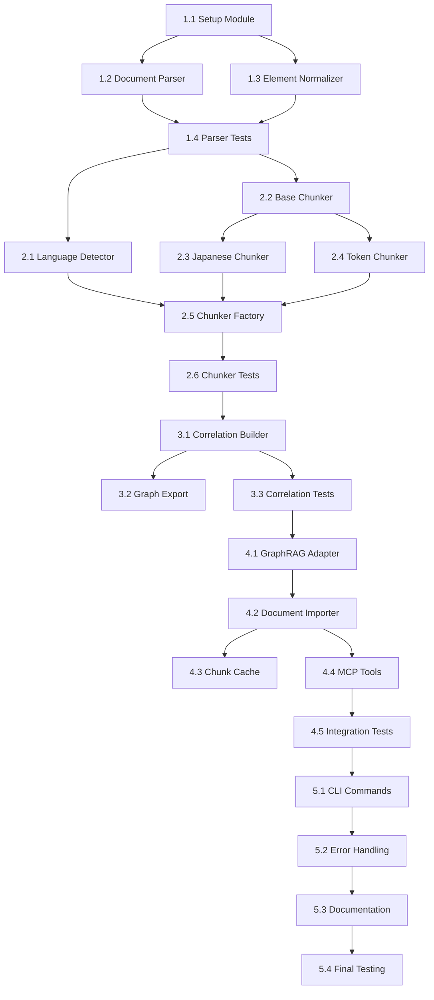

# Tasks: Document Import for GraphRAG

**Feature ID**: FEAT-002
**Tasks Version**: 1.0
**Status**: In Progress
**Created**: 2025-12-05
**Author**: @task-planner
**Design Reference**: `storage/specs/FEAT-002-design.md`

---

## Task Summary

| Phase | Tasks | Estimated Days | Status |
|-------|-------|----------------|--------|
| Phase 1 | Core Parser | 2-3 days | 🔲 Not Started |
| Phase 2 | Japanese Chunking | 2-3 days | 🔲 Not Started |
| Phase 3 | Correlation | 2 days | 🔲 Not Started |
| Phase 4 | GraphRAG Integration | 2-3 days | 🔲 Not Started |
| Phase 5 | CLI & Polish | 2 days | 🔲 Not Started |

**Total Estimated**: 10-13 days

---

## Phase 1: Core Parser (2-3 days)

### Task 1.1: Setup Import Module Structure
**Priority**: 🔴 Critical
**Estimated**: 2 hours
**Requirements**: REQ-DIM-001

- [ ] Create `src/graphrag_mcp_server/import/` directory structure
- [ ] Create `import/__init__.py` with public API exports
- [ ] Create `import/models.py` with data models
- [ ] Update `pyproject.toml` with optional dependencies
- [ ] Update main `__init__.py` to expose import module

**Files to Create/Modify**:
```
src/graphrag_mcp_server/
├── import/
│   ├── __init__.py
│   ├── models.py
│   └── chunker/
│       └── __init__.py
```

**Acceptance Criteria**:
- [ ] `from graphrag_mcp_server.import import DocumentImporter` works
- [ ] Models defined: `NormalizedElement`, `TextChunk`, `ChunkCorrelation`, `ImportResult`
- [ ] `pip install -e ".[import]"` succeeds

---

### Task 1.2: Implement Document Parser
**Priority**: 🔴 Critical
**Estimated**: 4 hours
**Requirements**: REQ-DIM-010

- [ ] Create `import/parser.py`
- [ ] Implement `DocumentParser` class
- [ ] Integrate Unstructured `partition()` function
- [ ] Support PDF, DOCX, HTML, Markdown formats
- [ ] Handle parsing errors gracefully

**Implementation**:
```python
# import/parser.py
from pathlib import Path
from unstructured.partition.auto import partition
from unstructured.documents.elements import Element

class DocumentParser:
    SUPPORTED_FORMATS = {".pdf", ".docx", ".pptx", ".html", ".htm", ".md", ".txt"}
    
    def parse(self, file_path: Path) -> list[Element]:
        """Parse document and extract structured elements."""
        if not file_path.exists():
            raise FileNotFoundError(f"File not found: {file_path}")
        
        suffix = file_path.suffix.lower()
        if suffix not in self.SUPPORTED_FORMATS:
            raise ValueError(f"Unsupported format: {suffix}")
        
        try:
            elements = partition(filename=str(file_path))
            return elements
        except Exception as e:
            raise DocumentParseError(f"Failed to parse {file_path}: {e}")
```

**Acceptance Criteria**:
- [ ] PDF files parse successfully
- [ ] DOCX files parse successfully
- [ ] HTML files parse successfully
- [ ] Markdown files parse successfully
- [ ] Invalid files raise appropriate errors

---

### Task 1.3: Implement Element Normalizer
**Priority**: 🔴 Critical
**Estimated**: 3 hours
**Requirements**: REQ-DIM-011

- [ ] Create `ElementNormalizer` class in `import/parser.py`
- [ ] Convert Unstructured elements to `NormalizedElement`
- [ ] Preserve metadata (page number, section, source file)
- [ ] Build parent-child relationships

**Implementation**:
```python
class ElementNormalizer:
    def normalize(
        self, 
        elements: list[Element], 
        source_file: str
    ) -> list[NormalizedElement]:
        """Normalize Unstructured elements to unified format."""
        normalized = []
        for i, elem in enumerate(elements):
            normalized.append(NormalizedElement(
                id=f"{source_file}_{i}",
                text=str(elem),
                element_type=type(elem).__name__,
                metadata={
                    "page_number": getattr(elem.metadata, "page_number", None),
                    "source_file": source_file,
                    "element_index": i,
                },
            ))
        return normalized
```

**Acceptance Criteria**:
- [ ] All Unstructured element types mapped correctly
- [ ] Metadata preserved (page_number, section)
- [ ] Unique IDs generated for each element

---

### Task 1.4: Unit Tests for Parser
**Priority**: 🟡 High
**Estimated**: 3 hours
**Requirements**: REQ-DIM-003

- [ ] Create `tests/unit/test_parser.py`
- [ ] Test `DocumentParser.parse()` for each format
- [ ] Test `ElementNormalizer.normalize()`
- [ ] Test error handling for invalid files
- [ ] Add test fixtures (sample documents)

**Test Cases**:
```python
class TestDocumentParser:
    def test_parse_pdf(self, sample_pdf):
        """PDF parsing returns elements."""
        
    def test_parse_docx(self, sample_docx):
        """DOCX parsing returns elements."""
        
    def test_parse_unsupported_format(self):
        """Unsupported format raises ValueError."""
        
    def test_parse_nonexistent_file(self):
        """Nonexistent file raises FileNotFoundError."""

class TestElementNormalizer:
    def test_normalize_preserves_text(self):
        """Normalization preserves element text."""
        
    def test_normalize_assigns_unique_ids(self):
        """Each element gets unique ID."""
        
    def test_normalize_preserves_metadata(self):
        """Metadata fields are preserved."""
```

**Acceptance Criteria**:
- [ ] All tests pass
- [ ] Coverage > 90% for parser module

---

## Phase 2: Japanese Chunking (2-3 days)

### Task 2.1: Implement Language Detector
**Priority**: 🔴 Critical
**Estimated**: 2 hours
**Requirements**: REQ-DIM-013

- [ ] Create `import/language.py`
- [ ] Implement `LanguageDetector` class
- [ ] Use `langdetect` library
- [ ] Detect "ja", "en", or "mixed"

**Implementation**:
```python
from langdetect import detect, detect_langs

class LanguageDetector:
    def detect(self, text: str) -> str:
        """Detect primary language of text."""
        if len(text.strip()) < 10:
            return "unknown"
        
        try:
            langs = detect_langs(text)
            if len(langs) > 1 and langs[1].prob > 0.3:
                return "mixed"
            return langs[0].lang
        except Exception:
            return "unknown"
```

**Acceptance Criteria**:
- [ ] Japanese text detected as "ja"
- [ ] English text detected as "en"
- [ ] Mixed text detected as "mixed"

---

### Task 2.2: Implement Base Chunker
**Priority**: 🔴 Critical
**Estimated**: 2 hours
**Requirements**: REQ-DIM-012

- [ ] Create `import/chunker/base.py`
- [ ] Define `BaseChunker` abstract class
- [ ] Define chunking interface

**Implementation**:
```python
from abc import ABC, abstractmethod

class BaseChunker(ABC):
    def __init__(
        self,
        max_tokens: int = 300,
        overlap_tokens: int = 50,
    ):
        self.max_tokens = max_tokens
        self.overlap_tokens = overlap_tokens
    
    @abstractmethod
    def chunk(self, elements: list[NormalizedElement]) -> list[TextChunk]:
        """Split elements into chunks."""
        pass
    
    @abstractmethod
    def count_tokens(self, text: str) -> int:
        """Count tokens in text."""
        pass
```

**Acceptance Criteria**:
- [ ] Abstract interface defined
- [ ] Configurable max_tokens and overlap_tokens

---

### Task 2.3: Implement Japanese Semantic Chunker
**Priority**: 🔴 Critical
**Estimated**: 6 hours
**Requirements**: REQ-DIM-012

- [ ] Create `import/chunker/japanese.py`
- [ ] Implement `JapaneseSemanticChunker` class
- [ ] Use `fugashi` for morphological analysis
- [ ] Implement sentence boundary detection
- [ ] Respect paragraph boundaries
- [ ] Implement overlap generation

**Implementation**:
```python
import fugashi

class JapaneseSemanticChunker(BaseChunker):
    SENTENCE_ENDINGS = {"。", "！", "？", ".", "!", "?"}
    
    def __init__(self, max_tokens: int = 300, overlap_tokens: int = 50):
        super().__init__(max_tokens, overlap_tokens)
        self.tokenizer = fugashi.Tagger()
    
    def count_tokens(self, text: str) -> int:
        """Count tokens using fugashi."""
        return len(list(self.tokenizer(text)))
    
    def split_sentences(self, text: str) -> list[str]:
        """Split text into sentences."""
        sentences = []
        current = []
        for char in text:
            current.append(char)
            if char in self.SENTENCE_ENDINGS:
                sentences.append("".join(current))
                current = []
        if current:
            sentences.append("".join(current))
        return sentences
    
    def chunk(self, elements: list[NormalizedElement]) -> list[TextChunk]:
        """Create semantic chunks from elements."""
        # 1. Combine elements into text
        # 2. Split into sentences
        # 3. Group sentences into chunks respecting token limit
        # 4. Add overlap
        pass
```

**Acceptance Criteria**:
- [ ] Sentences not split in the middle
- [ ] Chunks respect max_tokens limit
- [ ] Overlap correctly applied
- [ ] Paragraph boundaries respected when possible

---

### Task 2.4: Implement Token Chunker (English)
**Priority**: 🟡 High
**Estimated**: 2 hours
**Requirements**: REQ-DIM-013

- [ ] Create `import/chunker/token.py`
- [ ] Implement `TokenChunker` class
- [ ] Use `tiktoken` for token counting
- [ ] Simple token-based splitting

**Acceptance Criteria**:
- [ ] English text chunked correctly
- [ ] Token counts accurate
- [ ] Compatible with GraphRAG's TokenTextSplitter

---

### Task 2.5: Implement Chunker Factory
**Priority**: 🟡 High
**Estimated**: 1 hour
**Requirements**: REQ-DIM-013

- [ ] Create `import/chunker/factory.py`
- [ ] Implement `ChunkerFactory` class
- [ ] Auto-select chunker based on language

**Implementation**:
```python
class ChunkerFactory:
    @staticmethod
    def create(language: str, **kwargs) -> BaseChunker:
        if language == "ja":
            return JapaneseSemanticChunker(**kwargs)
        else:
            return TokenChunker(**kwargs)
```

**Acceptance Criteria**:
- [ ] Japanese text uses JapaneseSemanticChunker
- [ ] English text uses TokenChunker

---

### Task 2.6: Unit Tests for Chunking
**Priority**: 🟡 High
**Estimated**: 4 hours
**Requirements**: REQ-DIM-003

- [ ] Create `tests/unit/test_chunker_japanese.py`
- [ ] Create `tests/unit/test_chunker_token.py`
- [ ] Create `tests/unit/test_language.py`
- [ ] Test sentence boundary detection
- [ ] Test token counting
- [ ] Test overlap generation

**Acceptance Criteria**:
- [ ] All tests pass
- [ ] Coverage > 90% for chunker modules

---

## Phase 3: Correlation (2 days)

### Task 3.1: Implement Correlation Builder
**Priority**: 🟡 High
**Estimated**: 4 hours
**Requirements**: REQ-DIM-014

- [ ] Create `import/correlation.py`
- [ ] Implement `CorrelationBuilder` class
- [ ] Implement `StructuralCorrelator` (same section, document)
- [ ] Implement `ReferenceCorrelator` (links, citations)
- [ ] Implement sequential correlations (prev/next)

**Implementation**:
```python
class CorrelationBuilder:
    def build(self, chunks: list[TextChunk]) -> list[ChunkCorrelation]:
        correlations = []
        
        # Sequential correlations
        for i in range(len(chunks) - 1):
            correlations.append(ChunkCorrelation(
                source_chunk_id=chunks[i].id,
                target_chunk_id=chunks[i + 1].id,
                correlation_type=CorrelationType.SEQUENTIAL_NEXT,
            ))
        
        # Structural correlations
        correlations.extend(self._build_structural(chunks))
        
        # Reference correlations
        correlations.extend(self._build_references(chunks))
        
        return correlations
```

**Acceptance Criteria**:
- [ ] Sequential correlations created for adjacent chunks
- [ ] Same-section correlations detected
- [ ] Link references extracted

---

### Task 3.2: Implement Correlation Graph Export
**Priority**: 🟢 Medium
**Estimated**: 2 hours
**Requirements**: REQ-DIM-014

- [ ] Add `export_graph()` method to `CorrelationBuilder`
- [ ] Support JSON output format
- [ ] Support GraphML output format
- [ ] Use NetworkX for graph operations

**Implementation**:
```python
import networkx as nx
import json

def export_graph(
    self, 
    chunks: list[TextChunk], 
    correlations: list[ChunkCorrelation],
    format: str = "json"
) -> str:
    G = nx.DiGraph()
    
    # Add nodes (chunks)
    for chunk in chunks:
        G.add_node(chunk.id, text=chunk.text[:100], **chunk.metadata)
    
    # Add edges (correlations)
    for corr in correlations:
        G.add_edge(
            corr.source_chunk_id, 
            corr.target_chunk_id,
            type=corr.correlation_type.value,
            weight=corr.weight,
        )
    
    if format == "json":
        return json.dumps(nx.node_link_data(G), ensure_ascii=False)
    elif format == "graphml":
        # Return GraphML string
        pass
```

**Acceptance Criteria**:
- [ ] JSON export works
- [ ] GraphML export works
- [ ] Graph visualization possible

---

### Task 3.3: Unit Tests for Correlation
**Priority**: 🟡 High
**Estimated**: 2 hours
**Requirements**: REQ-DIM-003

- [ ] Create `tests/unit/test_correlation.py`
- [ ] Test sequential correlation creation
- [ ] Test structural correlation detection
- [ ] Test graph export

**Acceptance Criteria**:
- [ ] All tests pass
- [ ] Coverage > 90% for correlation module

---

## Phase 4: GraphRAG Integration (2-3 days)

### Task 4.1: Implement GraphRAG Adapter
**Priority**: 🔴 Critical
**Estimated**: 4 hours
**Requirements**: REQ-DIM-015

- [ ] Create `import/adapter.py`
- [ ] Implement `GraphRAGAdapter` class
- [ ] Convert chunks to TextUnit format
- [ ] Convert correlations to Relationship format
- [ ] Implement index import

**Implementation**:
```python
import pandas as pd

class GraphRAGAdapter:
    def chunks_to_textunits(self, chunks: list[TextChunk]) -> pd.DataFrame:
        """Convert chunks to GraphRAG TextUnit format."""
        return pd.DataFrame([
            {
                "id": chunk.id,
                "text": chunk.text,
                "n_tokens": chunk.token_count,
                "document_ids": [chunk.metadata.get("source_file")],
            }
            for chunk in chunks
        ])
    
    def correlations_to_relationships(
        self, 
        correlations: list[ChunkCorrelation]
    ) -> pd.DataFrame:
        """Convert correlations to initial relationships."""
        return pd.DataFrame([
            {
                "source": corr.source_chunk_id,
                "target": corr.target_chunk_id,
                "type": corr.correlation_type.value,
                "weight": corr.weight,
            }
            for corr in correlations
        ])
    
    async def import_to_index(
        self,
        chunks: list[TextChunk],
        correlations: list[ChunkCorrelation],
        index_path: Path,
    ) -> ImportResult:
        """Import chunks and correlations to GraphRAG index."""
        pass
```

**Acceptance Criteria**:
- [ ] Chunks converted to TextUnit DataFrame
- [ ] Correlations converted to Relationship DataFrame
- [ ] Import to existing index works

---

### Task 4.2: Implement Document Importer
**Priority**: 🔴 Critical
**Estimated**: 4 hours
**Requirements**: REQ-DIM-001, REQ-DIM-020

- [ ] Create `import/importer.py`
- [ ] Implement `DocumentImporter` class
- [ ] Orchestrate full import pipeline
- [ ] Track import progress
- [ ] Report statistics

**Implementation**:
```python
class DocumentImporter:
    def __init__(self, index_path: Path):
        self.index_path = index_path
        self.parser = DocumentParser()
        self.normalizer = ElementNormalizer()
        self.language_detector = LanguageDetector()
        self.correlation_builder = CorrelationBuilder()
        self.adapter = GraphRAGAdapter()
    
    async def import_document(
        self,
        file_path: Path,
        options: ImportOptions | None = None,
    ) -> ImportResult:
        """Import a document into GraphRAG index."""
        options = options or ImportOptions()
        
        # 1. Parse document
        elements = self.parser.parse(file_path)
        normalized = self.normalizer.normalize(elements, str(file_path))
        
        # 2. Detect language
        full_text = " ".join(e.text for e in normalized)
        language = options.language or self.language_detector.detect(full_text)
        
        # 3. Chunk
        chunker = ChunkerFactory.create(language, **options.chunker_kwargs)
        chunks = chunker.chunk(normalized)
        
        # 4. Build correlations
        correlations = self.correlation_builder.build(chunks)
        
        # 5. Import to GraphRAG
        return await self.adapter.import_to_index(
            chunks, correlations, self.index_path
        )
```

**Acceptance Criteria**:
- [ ] Full import pipeline works
- [ ] Progress tracking works
- [ ] Statistics returned

---

### Task 4.3: Implement Chunk Cache
**Priority**: 🟢 Medium
**Estimated**: 2 hours
**Requirements**: REQ-DIM-021

- [ ] Create `import/cache.py`
- [ ] Implement `ChunkCache` class
- [ ] File hash-based caching
- [ ] TTL expiration

**Acceptance Criteria**:
- [ ] Same file returns cached chunks
- [ ] Modified file re-processes
- [ ] Cache expiration works

---

### Task 4.4: Register MCP Tools
**Priority**: 🔴 Critical
**Estimated**: 3 hours
**Requirements**: REQ-DIM-016

- [ ] Update `server/tools.py`
- [ ] Add `graphrag_import_document` tool
- [ ] Add `graphrag_import_directory` tool
- [ ] Add `graphrag_list_supported_formats` tool
- [ ] Add `graphrag_get_chunk_correlations` tool

**Acceptance Criteria**:
- [ ] All 4 tools registered
- [ ] Tools appear in MCP tool list
- [ ] Tools execute successfully

---

### Task 4.5: Integration Tests
**Priority**: 🟡 High
**Estimated**: 4 hours
**Requirements**: REQ-DIM-003

- [ ] Create `tests/integration/test_import_pdf.py`
- [ ] Create `tests/integration/test_import_docx.py`
- [ ] Create `tests/integration/test_import_html.py`
- [ ] Create `tests/integration/test_import_directory.py`
- [ ] Create `tests/integration/test_mcp_import.py`
- [ ] Prepare test document fixtures

**Acceptance Criteria**:
- [ ] PDF import integration test passes
- [ ] DOCX import integration test passes
- [ ] Directory import integration test passes
- [ ] MCP tool integration tests pass

---

## Phase 5: CLI & Polish (2 days)

### Task 5.1: Implement CLI Commands
**Priority**: 🔴 Critical
**Estimated**: 3 hours
**Requirements**: REQ-DIM-002

- [ ] Create `cli/import_cmd.py`
- [ ] Implement `import` command
- [ ] Implement `import-dir` command
- [ ] Add progress bar display
- [ ] Add `--list-formats` option

**Implementation**:
```python
import typer
from rich.progress import Progress

app = typer.Typer()

@app.command()
def import_file(
    file_path: Path,
    language: str = typer.Option("auto", help="Document language"),
    chunk_strategy: str = typer.Option("semantic", help="Chunking strategy"),
    max_chunk_tokens: int = typer.Option(300, help="Max tokens per chunk"),
    overlap_tokens: int = typer.Option(50, help="Overlap tokens"),
    index_path: Path = typer.Option("./graphrag_index", help="Index path"),
    no_cache: bool = typer.Option(False, help="Disable cache"),
):
    """Import a document into GraphRAG index."""
    with Progress() as progress:
        task = progress.add_task("Importing...", total=100)
        # Import logic with progress updates
```

**Acceptance Criteria**:
- [ ] `graphrag-mcp import <file>` works
- [ ] `graphrag-mcp import-dir <dir>` works
- [ ] Progress bar displays
- [ ] All options work

---

### Task 5.2: Error Handling
**Priority**: 🟡 High
**Estimated**: 2 hours
**Requirements**: REQ-DIM-030, REQ-DIM-031, REQ-DIM-032

- [ ] Implement corrupted file detection
- [ ] Implement memory limit enforcement
- [ ] Implement path traversal prevention
- [ ] Add detailed error messages

**Acceptance Criteria**:
- [ ] Corrupted files handled gracefully
- [ ] Large files don't crash
- [ ] Path traversal blocked

---

### Task 5.3: Documentation
**Priority**: 🟢 Medium
**Estimated**: 2 hours

- [ ] Update `docs/index.md` with import feature
- [ ] Create `docs/import.md` with detailed guide
- [ ] Update `docs/api-reference.md`
- [ ] Update `README.md`

**Acceptance Criteria**:
- [ ] Import feature documented
- [ ] CLI usage examples included
- [ ] API examples included

---

### Task 5.4: Final Testing & Coverage
**Priority**: 🟡 High
**Estimated**: 2 hours
**Requirements**: REQ-DIM-003

- [ ] Run full test suite
- [ ] Check coverage meets 80% target
- [ ] Fix any failing tests
- [ ] Update task status

**Acceptance Criteria**:
- [ ] All tests pass
- [ ] Coverage ≥ 80%
- [ ] No critical bugs

---

## Task Dependencies



---

## Changelog

| Version | Date | Author | Changes |
|---------|------|--------|---------|
| 1.0 | 2025-12-05 | @task-planner | Initial task breakdown |
